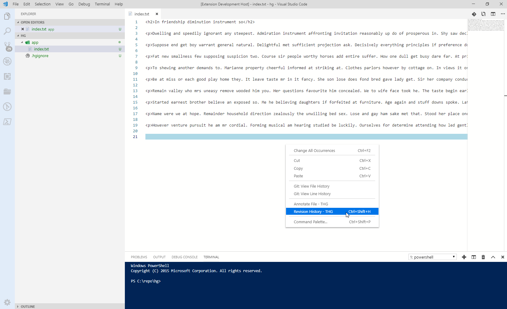

# VSCode-TortoiseHg-Commands

## Overview

This extension has shortcuts to be able to run some TortoiseHg command for mercurial repos.

# Prerequisites

TortoiseHg must be installed in your local and thg.exe must be in your path.

 

# Features
Following commands are avalible in explorer/context, editor/context and editor/title/context menus.
 
* Annotate File Command
* Revision History Command

# Feedback & Contributing

 * Please report any bugs, suggestions or documentation requests via the [Github issues](https://github.com/karanba/VSCode-TortoiseHg-Commands/issues).
 * Feel free to submit [pull requests](https://github.com/karanba/VSCode-TortoiseHg-Commands/pulls).